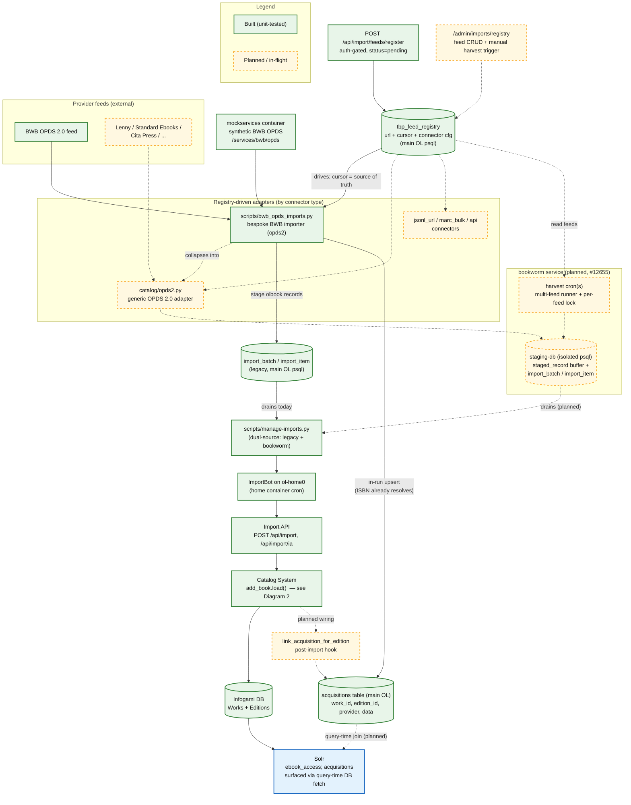
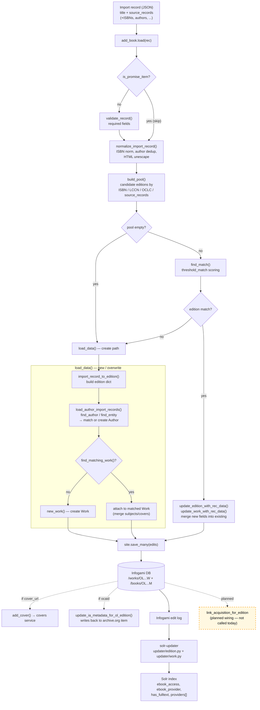

# Feed Registry & Acquisitions Import System

> **Status:** in-flight (prototype)
> **Sources:** code synthesis on branch `12844/feed-registry-acquisitions` / draft PR #13206 (`openlibrary/core/tbp.py`, `openlibrary/core/acquisitions.py`, `openlibrary/core/schema.sql`, `scripts/bwb_opds_imports.py`, `scripts/manage-imports.py`, `openlibrary/plugins/importapi/code.py`, `openlibrary/plugins/importapi/import_opds.py`, `openlibrary/catalog/add_book/`, `docker/mockservices/main.py`, `compose.yaml`, `compose.override.yaml`)
> **Last ingested:** 2026-07-27
> **Epic:** internetarchive/openlibrary#12844 (Feed Registry & Acquisitions Import System); related #12655 (BookWorm), #5792 (Trusted Book Providers), #11264 (Solr acquisitions)

## Nothing schedules a harvest. The front half of the pipeline never runs.

Verified 2026-09-20 against `olsystem` `origin/HEAD` by two agents
independently, one of whom did not look at the other's claim before starting.

**`grep -il "bookworm\|harvest"` across the entire olsystem tree returns
zero.** Not zero in `ol_home0`'s crontab — zero *anywhere*, across all eleven
cron files and every host. The ol-home0 crontab schedules eleven jobs:
`archive.py`, `check_space.sh`, `cron_wrapper.py`, `expire_accounts.py`,
`manage-imports.py`, `notify_slack.sh`, `oldump.sh`, `process_partner_data.sh`,
`promise_batch_imports.py`, `store_counts.py`,
`update_stale_work_references.py`. No harvest among them.

**Why grepping the `openlibrary` repo proves nothing here.**
`docker/ol-cron-start.sh` runs `crontab /etc/cron.d/openlibrary.ol_home0`, and
that file lives in **olsystem**, a separate repo. Anyone looking for scheduled
jobs in the application repo will find nothing and learn nothing.

**The shape of the gap, which is sharper than "a cron is missing":**

| Piece | State |
|---|---|
| Feeds registered and active | ✅ |
| Harvest runner (#13565) | ✅ merged |
| Something that invokes it on a schedule | ❌ **does not exist** |
| ImportBot (`manage-imports.py`) draining the queue | ✅ scheduled and running |

So the **back half of the pipeline is live and waiting, and the front half
never fires.** ImportBot would process anything staged; nothing stages
anything. The ~94 records harvested in production were run **by hand** by an
agent — that is the entire harvest history of the system.

**Consequence for [[#12655]] planning: this is the only missing piece, and it
is one crontab line in olsystem.** Configuration, not a project. It should be
reordered ahead of every other item in the epic — and note it interacts with
the unbounded-row-fetch follow-up, which must land *before* harvest volume
scales (see [[pr-13395-state]]).

**The one gap, stated rather than papered over:** nobody has verified that the
crontab actually deployed on ol-home0 matches olsystem `origin/HEAD`. An entry
added by hand on the box, outside version control, would not appear in this
check. Unlikely — container start overwrites the crontab from the file — but
unlikely is not checked. Settled by `crontab -l` on ol-home0, which needs
shell access no agent has.

> **Provenance note.** This began as an unverified claim that was carried for
> two days, then formally **retracted** as never-checked, and was only then
> answered from scratch by an agent deliberately not shown the retracted
> version. Arriving independently at a retracted claim's conclusion is the one
> circumstance that makes it trustworthy — and it took a retraction to get it
> checked at all. See [[METHODOLOGY]].

## Reconciliation, 2026-09-20: what BookWorm actually is vs. what #12655 describes

Done before decomposing #12655 into agent-ownable units, because the epic's
checkboxes do not describe the built system and planning from them would have
produced work to rebuild merged code.

**Four "Phase 1 — Foundation, to do" checkboxes are merged:** the BookWorm
service (#13241), the cron runner + feed registration (#13565), the
borrow-link harvester fix (#13561), and the Amazon lookup migration (#13173 —
listed under Phase 2).

**BookWorm as built is a harvester library plus a CLI. It is not the service
#12655 specifies.** `openlibrary/bookworm/` on master is `harvest.py`,
`opds.py`, `registry.py` and `cli.py` — the last exposing `harvest`,
`register` and `preview` subcommands via argparse. There is **no**
`/v1/imports/batch`, no `/v1/lookup/isbn/{isbn}`, no API-key auth, no
`openlibrary_imports` database, no ASGI mount and no compose service. The
epic's central architectural premise is unbuilt, and whether it is still
wanted is an architecture decision, not an engineering task — it determines
whether roughly half the epic's remaining units exist at all.

**`12844/bookworm-service` is a superseded scheduling approach, not stranded
features.** 12 commits, 1,662 insertions, **215 behind master**. Of its 23
files, 19 are now on master via the merged PRs above. The four that are not:

| File | Lines | What it is |
|---|---|---|
| `bookworm/server.py` | 88 | A FastAPI app whose *lifespan* starts `_harvest_loop()` — a container that self-schedules harvests. **Not an API surface**; it declares no routes. |
| `bookworm/tests/test_server.py` | 22 | its tests |
| `docker/ol-bookworm-start.sh` | 6 | container entrypoint |
| `bookworm/V2_PR_DESCRIPTION.md` | 18 | prose |

So master and the branch are two competing answers to *how does harvest get
scheduled* — CLI invoked by cron, versus a self-scheduling container. Neither
is the epic's service.

**And per ada-8f (unverified here): the harvest cron was never installed.** If
that holds, *neither* scheduling mechanism is running, feeds are registered
and active, and nothing fires. That would make installing a scheduler the
highest-value item in the epic and configuration rather than a project — but
it is one claim from one agent and nobody has re-derived it.

**Recommendation:** close `12844/bookworm-service` rather than rebase it. 215
commits behind, and its only unique contribution is a scheduling wrapper that
competes with the CLI already on master. Preserve the question it answers —
*what schedules the harvest* — as its own decision.

> ⚠️ **Design in flight.** This system is actively being built. Most of it is planned; a tested prototype layer exists on branch `12844/feed-registry-acquisitions` (draft PR #13206), verified at the SQLite/unit level only — **no live end-to-end loop has run yet**. Everything below is annotated **built** vs **planned/in-flight**; treat the planned parts as design intent, not shipped behavior.

This is the shared-context architecture doc for the epic. It describes the target ("end-state") system, then two flow diagrams: the **import ecosystem** (how partner feeds become catalog records + acquisitions) and the **catalog system** (how any import record becomes a Work/Edition in Infogami + Solr). It complements [[trusted-book-providers]], which covers where acquisition data lives today and the migration off Infogami edition objects.

---

## End-state overview & goals

Open Library is a catalog of every book: each unique **work** (the parent) has one or more **editions** (children), and an edition may carry zero or more **acquisitions** — OPDS-style options to buy (a price, currency, link), borrow, or read it. Today, onboarding a new trusted partner feed (BWB OPDS, Lenny, Standard Ebooks, Cita Press, …) means writing a bespoke ingestion script per source. The goal of this epic is to make onboarding a feed **"add a registry row," not "write and deploy a script,"** and to give acquisitions a real home so they can be searched and surfaced.

The target system has five moving parts:

1. **Feed Registry** (`tbp_feed_registry`, main OL psql) — the source of truth for which partner feeds OL ingests, each row holding the feed URL, an incremental **cursor** (`last_updated`), the connector type, and an open-ended `data` blob (trust level, polling cadence, record caps, cover-import flag). Feeds are added two ways: partners self-enlist via `POST /api/import/feeds/register` (recorded `status="pending"`, awaiting maintainer promotion — mirroring the account-linking policy for Lenny lending instances), or maintainers manage them through an `/admin/imports/registry` CRUD surface.

2. **Registry-driven adapters** — instead of one script per source, the registry parameterizes a small set of **connector types**: `opds2` (the near-term focus — a generic OPDS 2.0 adapter at `openlibrary/catalog/opds2.py`), plus planned `jsonl_url`, `marc_bulk`, and `api`. Per-source quirks (e.g. BWB's specific fields) become centrally-maintained special-cases rather than forked scripts. The existing bespoke BWB importer is the reference implementation that will collapse into the generic `opds2` adapter.

3. **Staging (BookWorm, #12655)** — a dedicated `bookworm` FastAPI container with its own isolated `staging-db` psql, so bulk feed harvesting never contends with production OL psql. It owns the harvest cron(s) and holds a raw `staged_record` buffer plus its **own** `import_batch`/`import_item` tables. This is the "separate DB, FastAPI service, real-time OPDS bot" idea from the BookWorm epic.

4. **`manage-imports` (dual-source)** — the existing continuous batch-import processor evolves to **drain both** the legacy main-schema `import_batch`/`import_item` **and** the BookWorm staging-db's import tables, promoting staged records into the real catalog. ImportBot (running on `ol-home0` in prod, the `home` container in dev) drives it, hitting the existing import API endpoints.

5. **Acquisitions + Solr** — acquisitions are edition-scoped facts (price, format, access, URL) that currently live incorrectly on Infogami edition objects (the `providers` list). They move to the `acquisitions` table (main OL, one row per `(edition, provider)`, keyed on `(local_id, provider_name)` so work/edition merges never conflict). Acquisitions are surfaced in search via **query-time DB fetch** (join at query time for a page of results), not by embedding them in the Solr index — avoiding index bloat. This lets patrons eventually search by price / availability ("what books are for sale?", "what's available through trusted providers?") and feeds `ebook_access` deduction. Open question (unresolved): whether well-defined implicit providers like IA's ~6M ocaids should be materialized as rows or stay derived — see [[trusted-book-providers]].

### Build status at a glance

| Piece | State | Notes |
|---|---|---|
| `tbp_feed_registry` + `FeedRegistry` (register/advance/find/all/from_request) | **Built** | `core/tbp.py`; lives in **main** OL psql schema; unit/SQLite-tested only |
| `acquisitions` table + `Acquisition` interface | **Built** | `core/acquisitions.py`; merged via #12851; stays in **main** OL |
| First live acquisitions writer (`build_acquisition_data` / `upsert_acquisition`) | **Built** | in the BWB script; idempotent upsert on `(local_id, provider_name)` |
| `POST /api/import/feeds/register` | **Built** | auth-gated (`can_write`→403); records submitter + `status="pending"` |
| FeedRegistry cursor = source of truth for BWB incremental state | **Built** | `resolve_cutoff`/`advance_cursor`; file-state is fallback only |
| Edition resolution option (a): in-run attach for ISBNs that **already** resolve | **Built** | `resolve_edition_ids` + `stage_acquisitions` (existing editions only) |
| `mockservices` synthetic BWB OPDS 2.0 feed | **Built** | `docker/mockservices/main.py` → `/services/bwb/opds` |
| Generic `opds2` adapter (`openlibrary/catalog/opds2.py`); BWB collapses into it | **Planned** | today the BWB importer is bespoke; `importapi/import_opds.py` is a separate OPDS **1.x XML** parser |
| `link_acquisition_for_edition` post-import hook **wiring** | **Planned wiring** | the function EXISTS but is called by nothing except its own test — not wired into `manage-imports`/`add_book` |
| `/admin/imports/registry` view + feed CRUD + manual harvest + per-feed lock + multi-feed cron | **Planned** | operator surface |
| `bookworm` container + `staging-db` + `staged_record` buffer + its own import tables | **Planned** | Option B of #12655; owns harvest cron; runs on dev too |
| `manage-imports` dual-source drain (legacy + bookworm staging-db) | **Planned** | today it drains only the legacy main-schema import tables |
| Solr surfacing of acquisitions (query-time DB fetch) | **Planned (docs-only)** | no code yet |
| Live end-to-end loop (feed → manage-imports → real edition → acquisition) | **Not yet run** | core remaining validation target |

---

## Diagram 1 — Import ecosystem

> ⚠️ **Design in flight; built vs planned as annotated.** Solid green = built & unit-tested; dashed amber = planned / in-flight. "Built" here means unit/SQLite-tested on the prototype branch, not live in production.

Notes: Solr itself is built (blue = exists today, computing `ebook_access` from the edition), but acquisition surfacing from the new table is the planned query-time-fetch part. `manage-imports` and ImportBot exist today (built) draining the legacy tables; the **dual-source** second drain from the bookworm staging-db is the planned addition.

---

## Diagram 2 — Catalog System (`add_book.load()`)

> ⚠️ **Design in flight**, but **this diagram documents EXISTING catalog behavior** — the pipeline every import path already terminates in today (`openlibrary/catalog/add_book/`). It is the "under the hood" of the `Catalog System` node in Diagram 1. The only in-flight element is the dashed acquisitions hook, which is not yet wired in.

Key behaviors this captures (all existing): every import path — direct `/api/import`, IA bulk MARC, batch queue — funnels into `add_book.load()`; promise items skip `validate_record`; matching is ISBN/LCCN/OCLC-pool + `threshold_match`; a matched edition is updated in place while an unmatched record creates Edition + (matched-or-new) Work + (matched-or-new) Author; everything is persisted via one `site.save_many(edits)` into Infogami, which the `solr-updater` reflects into Solr. `ebook_access` / `providers[]` are computed from the Infogami edition at index/fetch time today (see [[trusted-book-providers]]).

---

## Key files

| File | Role | State |
|---|---|---|
| `openlibrary/core/tbp.py` | `FeedRegistry` interface + cursor | built |
| `openlibrary/core/acquisitions.py` | `Acquisition` DB interface (upsert on `(local_id, provider_name)`) | built |
| `openlibrary/core/schema.sql` (~L135, ~L152) | `acquisitions` + `tbp_feed_registry` DDL (main schema) | built |
| `scripts/bwb_opds_imports.py` | BWB OPDS importer; first acquisitions writer; `link_acquisition_for_edition` hook | built (hook unwired) |
| `openlibrary/plugins/importapi/code.py` (`feed_register_api`, ~L513) | `POST /api/import/feeds/register` | built |
| `openlibrary/plugins/importapi/import_opds.py` | OPDS **1.x XML** parser (distinct from the 2.0 JSON path) | existing |
| `scripts/manage-imports.py` | batch-import drainer / promoter (`do_import`→import API) | built (single-source) |
| `openlibrary/catalog/add_book/__init__.py` (`load`, `load_data`) | catalog record creation | existing |
| `openlibrary/catalog/add_book/load_book.py` | author resolution + `import_record_to_edition` | existing |
| `docker/mockservices/main.py` (~L443) | synthetic BWB OPDS feed endpoint | built |
| `compose.override.yaml` (`home`, `mockservices`, `db`) | dev services; ImportBot host; **no** `bookworm`/`staging-db` yet | mixed |

---

## Dependencies

*Depends on →* [[trusted-book-providers]] (acquisition storage model + `book_providers.py`), [[../imports|Imports]] (`add_book.load()` pipeline), Infogami, Solr.
*Depended on by →* [[../features|Features]], search-by-price / availability filtering, `ebook_access` deduction.

---

*See [[README]] · [[trusted-book-providers]] · epic internetarchive/openlibrary#12844*
