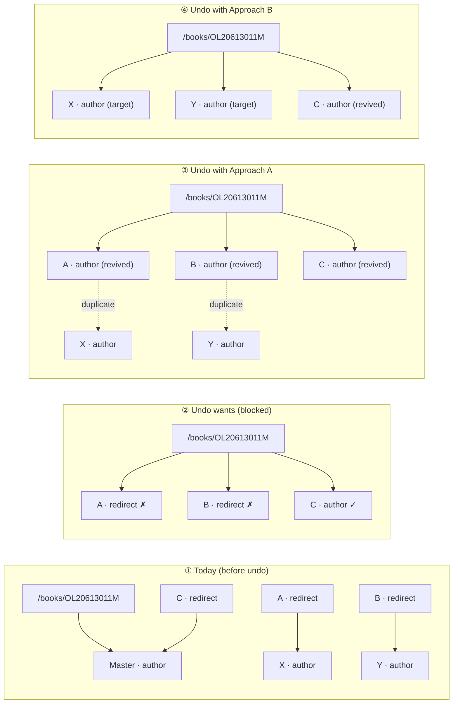
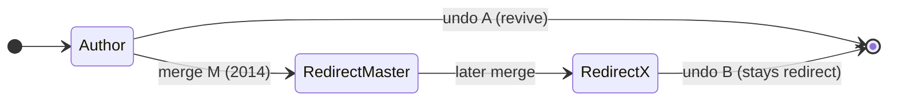

# Issue #5664 — "Undo All" on an author merge returns 500

**Status:** Reproduced locally end-to-end against a dev instance with production data.
**Repro artifacts:** `infogami/infobase/tests/test_merge_authors_undo.py` (minimal regression test).

---

## TL;DR

Clicking **Undo All** on a historical *merge-authors* recentchanges entry
(`POST /recentchanges/2014/04/04/merge-authors/47986246`) returns **HTTP 500**:

```
infogami.infobase.client.ClientException
json_data: {"error": "bad_data",
            "message": "expected /type/author, found /type/redirect",
            "at": {"key": "/books/OL20613011M", "property": "authors"},
            "value": "/authors/OL5993248A"}
```

(`value` is the first failing ref in the R−1 authors list — validation stops there; the traceback truncates it, but the list order makes it `OL5993248A`.)

The undo flow fetches every changed document at `revision − 1` (its pre-merge
state) and saves them in **one** `save_many` call. A pre-merge edition can
reference authors that were **not** part of the merge being undone — because
they were merged into other authors by *separate* merges — so their current
type is `/type/redirect`. Infogami's `SaveProcessor` validates every reference
against the referenced thing's **current** type and rejects the edition
(`authors` must be `/type/author`, not `/type/redirect`).

The failing layer is Infogami's validation, but the **bug belongs to Open
Library**: its undo logic produces a save that violates its own data model,
and the hook designed for exactly this (`process_docs_before_undo`) is a
no-op since 2018 (commit `5bd2bcc20` removed the only override).

---

## 1. Exactly what the bug is

### 1.1 The failing call chain

```
POST /recentchanges/2014/04/04/merge-authors/47986246
  → openlibrary/plugins/upstream/recentchanges.py
      recentchanges_view.POST: requires super-librarian, then change._undo()
  → openlibrary/plugins/upstream/models.py
      Changeset._undo()  (line ~926)
          docs = [self._get_doc(c["key"], c["revision"] - 1) for c in self.changes]
          docs = self.process_docs_before_undo(docs)     # ← no-op today
          return web.ctx.site.save_many(docs, action="undo",
                                        data={"parent_changeset": self.id},
                                        comment="undo " + self.comment)
  → infogami/infobase/writequery.py
      SaveProcessor.process_many / process_value
          raise BadData("expected /type/author, found /type/redirect", at=..., value=...)
  → infogami/infobase/client.py ClientException  → HTTP 500
```

### 1.2 Why the save is invalid

`_undo()` restores the **pre-merge revision** of every doc in the changeset.
For merge 47986246 that includes `/books/OL20613011M`, whose pre-merge
revision lists authors:

```
R−1 (pre-merge): authors = [ /authors/OL5993248A, /authors/OL5993619A, /authors/OL6025265A ]
R   (post-merge): authors = [ /authors/OL5873167A ]   (the master)
```

None of `OL5993248A`, `OL5993619A`, `OL6025265A` were the master — but only
`OL6025265A` was a **duplicate of this merge** (and is therefore *in the
changeset*). `OL5993248A` and `OL5993619A` were merged into *other* authors
(`OL1063178A`, `OL115275A`) by different, later merges, so today they are
`/type/redirect` and are **not** restored by this undo.

Infobase's `SaveProcessor.process_many` resolves types as follows:

1. For every doc **in the batch**, the type is taken from the batch doc itself
   (`self.types[doc["key"]] = parse_type(doc.get("type"))`).
2. For every **reference** to a key *not* in the batch, the type is looked up
   in the database — i.e. the **current** type.

So authors restored by *this* undo pass validation (their R−1 type
`/type/author` comes from the batch), but authors merged by *other* merges
fail, because their DB type is `/type/redirect`. That is exactly the error:
`expected /type/author, found /type/redirect` at
`/books/OL20613011M.authors`.

### 1.3 Verified production facts (changeset 47986246, 2014-04-04)

| Key | In changeset? | Type today (prod) | Notes |
|---|---|---|---|
| `/authors/OL5873167A` | yes | `/type/author` | the master |
| `/authors/OL6025265A` | yes | `/type/author` | duplicate of this merge; undo restores it fine |
| `/authors/OL5993248A` | **no** | `/type/redirect` → `OL1063178A` | merged by a later, separate merge |
| `/authors/OL5993619A` | **no** | `/type/redirect` → `OL115275A` | merged by a later, separate merge |
| `/books/OL20613011M` | yes | `/type/edition` | its R−1 authors include the two redirects |

Changeset totals: **176 changes** (70 author entries incl. master, 106 books),
`data = {"master": "/authors/OL5873167A", "duplicates": [69 keys]}`.

### 1.4 Why it gets worse over time

Every subsequent merge that takes a formerly-merged author as a *duplicate*
and re-points its redirect adds another landmine to every book that referenced
it pre-merge. The pre-merge editions accumulate references to redirects that
grow further and further from the merge being undone. (Un-merges also make it
worse in a different way: they change "current type" so you can't reliably
derive the 2014 master from today's data.)

### 1.5 The 2018 regression

Commit `5bd2bcc20` (2018, Charles Horn) **removed** the only
`process_docs_before_undo` override, from `MergeAuthors`. The old code
followed work-author redirects before undoing; the commit message explains the
reasoning:

> "remove author merge before_undo processing — this method followed the
> previous works' author redirects, which we are trying to undo, and updated
> the doc's author to that target. I think we just want a simple undo to
> latest rev - 1 for all docs."

The "simple undo to rev − 1" decision is precisely what makes #5664
reproduce: rev − 1 can reference authors that are redirects today.

---

## 2. Exactly how to reproduce (full end-to-end)

What follows is the exact procedure used to reproduce the issue on a local dev
instance (`docker compose up` on `localhost:8080`) with faithful production
data. It requires network access to `openlibrary.org` to fetch the historical
data.

### Prerequisites

- Dev stack running: `docker compose up` (web.py on `localhost:8080`).
- A super-librarian session cookie for the local user `openlibrary`
  (password `openlibrary`). Get one with the JSON login:

  ```bash
  curl -s -c /tmp/ck.txt -o /dev/null -X POST http://localhost:8080/account/login.json \
    -H 'Content-Type: application/json' \
    -d '{"username":"openlibrary","password":"openlibrary"}'
  # session cookie is in /tmp/ck.txt; or use the dev "admin" cookie directly
  ```

### Step 1 — Fetch the changeset metadata

```bash
curl -s 'https://openlibrary.org/recentchanges/2014/04/04/merge-authors/47986246.json' \
  -o /tmp/merge_changeset.json
# 176 changes; data.master = /authors/OL5873167A; 69 duplicates
```

### Step 2 — Copy the docs with copydocs (two dev-only quirks to patch)

Run copydocs from the `home` container, pointed at the dev app:

```bash
docker compose run --rm home bash -c '
  printf "[web:8080]\nusername = openlibrary\npassword = openlibrary\n" > ~/.olrc
  KEYS=$(python3 -c "import json,sys; print(\" \".join(c[\"key\"] for c in json.load(open(\"/tmp/merge_changeset.json\"))[\"changes\"]))")
  python scripts/copydocs.py --src http://openlibrary.org/ --dest http://web:8080 \
    --comment "issue-5664 repro" $KEYS'
```

Because copydocs' recursive ref-following and auth hit two quirks of the local
dev app, the run used a small wrapper (`copydocs_repro.py`, since deleted) that
patched `openlibrary.api.OpenLibrary`:

1. **Login is JSON-only.** The running infogami's `/account/login` expects a
   JSON body; the form POST (which copydocs' `~/.olrc` autologin performs)
   returns 200 but never sets a session (verified via curl — no `Set-Cookie`),
   so copydocs' writes never authenticate. Patch `OpenLibrary.login` to POST
   JSON to `/account/login.json`.
2. **The `Opt` header must match `http_ext_header_uri`.** infogami's
   `get_custom_headers()` (`infogami/plugins/api/code.py`) only returns the
   `HTTP_<ns>_*` custom headers when the `Opt` header's `decl_uri` equals the
   app's configured `http_ext_header_uri`; on mismatch it returns empty (and
   in the running dev container, `None`, causing an `AttributeError` → 500 on
   `api/save_many`). The accepted value differs from the checked-in default
   (`http://infogami.org/api`), so probe the running app — here it was
   `Opt: "http://openlibrary.org/dev/docs/api"; ns=42`.

Result: all **176 changed docs + recursive refs** (~90 works, ~80 extra
authors) copied with **zero save failures**.

> Note: copydocs strips `authors` from editions as it copies ("Authors are now
> with works"), so the *current* editions it writes locally have no authors.
> This does not matter for the reproduction because Step 3 overwrites every
> changed doc with its exact production revisions.

### Step 3 — Insert the changeset row + exact historical revisions (SQL)

copydocs only copies *current* revisions, but `_undo()` fetches each doc at
`revision − 1`, so the local version history must match production exactly.
The repro script (`/tmp/repro_sql.py`; approach below) did this via `psql`
against the `db` container:

1. For each of the 176 `(key, revision)` pairs, fetch from production
   `https://openlibrary.org<key>.json?v=<revision-1>` and `?v=<revision>`.
2. `INSERT INTO transaction` row **47986246**
   (`action='merge-authors'`, author `openlibrary`, timestamp
   `2014-04-04T12:51:09`, `changes` = the 176 changes, `data` =
   `{"master": "/authors/OL5873167A", "duplicates": [...]}`), plus a synthetic
   pre-merge `edit` transaction **47986247** so the R−1 `version` rows have a
   home.
3. For each thing: `DELETE` its existing `data`/`version` rows, `INSERT` the
   R−1 and R `data` rows (with `revision`/`latest_revision`/`last_modified`
   set to the production values), `INSERT` matching `version` rows pointing at
   transactions 47986247/47986246, and `UPDATE thing.latest_revision`.

### Step 4 — Fill any R−1-referenced docs missing locally

copydocs follows only *current* refs, so authors referenced only by R−1
revisions were absent locally. A helper (`/tmp/find_missing_refs.py` +
`/tmp/fill_refs.py`) found every ref in the R−1 docs that had no local `thing`,
verified each one **exists on production** (all 24 did), and inserted minimal
`thing` + `data` + `version` rows (property tables left empty).

> ⚠️ Gotcha: if you skip this, the first undo attempt fails with a *different*
> error — `{"error": "notfound", "key": "/authors/OL5993248A", ...}` — because
> the referenced author doesn't exist locally. That is an **artifact of
> incomplete data, not the bug**. The real bug (redirect vs author) only shows
> once all referenced docs exist.

### Step 5 — Trigger the undo

```bash
COOKIE='session=<your-super-librarian-session-cookie>'

# The page renders with the "Undo All" button:
curl -s -o /tmp/rc.html -w 'HTTP:%{http_code}\n' \
  http://localhost:8080/recentchanges/2014/04/04/merge-authors/47986246 \
  -H "Cookie: $COOKIE"        # → 200, contains "Undo All"

# Clicking Undo All (POST):
curl -s -o /tmp/undo.html -w 'HTTP:%{http_code}\n' -X POST \
  http://localhost:8080/recentchanges/2014/04/04/merge-authors/47986246 \
  -H "Cookie: $COOKIE"        # → 500
```

### Expected result

HTTP 500 with *"Sorry. There seems to be a problem with what you were just
looking at."* The server traceback shows
`infogami.infobase.client.ClientException` carrying:

```json
{"error": "bad_data",
 "message": "expected /type/author, found /type/redirect",
 "at": {"key": "/books/OL20613011M", "property": "authors"},
 "value": "/authors/OL5993248A"}
```

The failure is **deterministic** (same error on every run), the infobase
write rolls back (nothing partially saved — no `undo` transaction appears),
and the recentchanges page still renders afterward.

---

## 3. Minimal regression test

`infogami/infobase/tests/test_merge_authors_undo.py` (in the `vendor/infogami`
submodule — `infogami/` is a symlink into it) reproduces the exact error with
a tiny dataset and no network:

- `test_undo_fails_when_edition_references_redirect_author` — the #5664 case:
  master, a duplicate author, and an edition referencing it; the merge rewrites
  the edition; a *separate* merge later turns the duplicate into a
  `/type/redirect`; the undo (helper mimics `Changeset._undo`) raises
  `BadData` with the exact error dict above.
- `test_undo_succeeds_when_duplicates_are_restored` — the contrast: when the
  referenced authors **are** in the changeset (restored to `/type/author` in
  the same batch), the identical undo succeeds, because `SaveProcessor` uses
  the batch's own types for in-batch refs.

It runs against a real postgres (`infobase_test`) like the rest of the
infobase suite. The failing test deliberately **pins the buggy behavior** —
when the fix lands, it should be flipped to assert the undo succeeds.

Run it in the dev environment (two local quirks: the infobase tests need a
`postgres` host alias, and the `ol-vendor` volume shadows host submodule
edits, so the file must be mounted in):

```bash
docker compose run --rm --user root \
  -v "$PWD/infogami/infobase/tests/test_merge_authors_undo.py:/openlibrary/vendor/infogami/infogami/infobase/tests/test_merge_authors_undo.py:ro" \
  home bash -c 'echo "$(getent hosts db | awk "{print \$1}") postgres" >> /etc/hosts \
    && export USER=openlibrary PGUSER=openlibrary \
    && pytest infogami/infobase/tests/test_merge_authors_undo.py -v'
```

---

## 4. Approaches to fix it

All fixes belong in **Open Library** (`openlibrary/plugins/upstream/models.py`).
Loosening Infogami's validation is the wrong layer (see D). The extension
point is `Changeset.process_docs_before_undo` — a hook that exists precisely
so subclasses can adjust docs before the undo save — currently a no-op.

### Visual comparison: restore (A) vs follow (B)

Same story, five pictures. The cast (real production OLIDs):

```
A = /authors/OL5993248A   B = /authors/OL5993619A   C = /authors/OL6025265A
X = /authors/OL1063178A   Y = /authors/OL115275A    Master = /authors/OL5873167A
```

**① Today — before the undo:**

```text
┌──────────┐   authors    ┌──────────────────┐
│   book   │────────────▶│  Master (author)  │
└──────────┘             └──────────────────┘

A ──redirect──▶ X     B ──redirect──▶ Y     C ──redirect──▶ Master
   (author)          (author)              (author)
```

**② What the undo wants to write — and why it's blocked:**

```text
┌──────────┐   authors    ┌─────┐  ┌─────┐  ┌─────┐
│   book   │────────────▶│  A  │  │  B  │  │  C  │
└──────────┘             └─────┘  └─────┘  └─────┘
                          redirect  redirect  (in batch → author)
                           ✗        ✗
   "expected /type/author, found /type/redirect"  ← HTTP 500
```

**③ Approach A — restore the referenced redirect authors ("time machine"):**

```text
revive:  A ──▶ [A · author]      X stays as-is ── (now a DUPLICATE of A)
revive:  B ──▶ [B · author]      Y stays as-is ── (now a DUPLICATE of B)
revive:  C ──▶ [C · author]      (was already in the batch)

┌──────────┐   authors    ┌─────┐  ┌─────┐  ┌─────┐
│   book   │────────────▶│  A  │  │  B  │  │  C  │   ✓ exact 2014 state
└──────────┘             └─────┘  └─────┘  └─────┘
                          but A & X now both exist → duplicate problem re-created
```

**④ Approach B — follow the redirects ("soft undo"):**

```text
A stays redirect──▶ X      B stays redirect──▶ Y      C revived as author

┌──────────┐   authors    ┌─────┐  ┌─────┐  ┌─────┐
│   book   │────────────▶│  X  │  │  Y  │  │  C  │   ✓ valid save
└──────────┘             └─────┘  └─────┘  └─────┘
                          but the book never listed X or Y in 2014
```

**⑤ Why they diverge — A's life story (B is identical):**

```text
A: [author] -- 2014 merge M --> [redirect -> Master] -- later merge --> [redirect -> X]
                            |                                        |
                            +-- undo A: back to [author]            +-- undo B: stays redirect
```

The same state transitions, as a Mermaid diagram (renders on GitHub):





### A. Restore referenced redirect authors in the same batch *(recommended)*

In `MergeAuthors.process_docs_before_undo`:

1. Walk the docs being restored and collect every author reference
   (`edition.authors`, `work.authors` entries).
2. For each ref whose **current** type is `/type/redirect` and that is **not
   already in the batch**, fetch its pre-redirect revision (walk its version
   history backwards to the last revision whose type is `/type/author`) and
   append it to the batch.
3. Because the author is now in the batch with type `/type/author`,
   `SaveProcessor` validates the edition's refs against the batch — no
   `BadData`, and the undo fully restores the historical state.

- **Pros:** faithful — the merge is truly undone, including the authors the
  pre-merge books referenced; reuses the batch type-resolution behavior that
  already works for in-changeset duplicates.
- **Cons:** undoing merge M also un-does part of *later* merges (it revives
  authors that were intentionally merged away). Version-history walking is
  only needed for the (rare) failing refs.

### B. Follow redirects in the restored docs *(the 2018 approach, narrowed)*

Rewrite author refs that point at redirects to their redirect targets
(Open Library already has a `follow_redirect()` helper in `models.py`), and
only for refs **not** in the batch (in-batch authors are being restored, so
they should stay).

- **Pros:** minimal diff; no author restorations that "fight" later merges.
- **Cons:** the restored doc is not the literal R−1 state (a "soft undo"); if
  the redirect target was itself later merged, a single hop may not resolve;
  authorship history diverges from what the merge actually changed. This is
  the trade-off the 2018 removal rejected ("we just want a simple undo").

### C. Hybrid A+B *(probably the right end state — but see the open question)*

Restore authors that this undo logically owns; for refs that are redirects
because of *later* merges, decide per-ref — e.g. if the redirect was created
*after* this changeset's timestamp, follow it (respect the later merge); if it
predates it, restore the pre-redirect author. Note the rule's direction is a
product decision, not a technical one: one could equally argue the opposite
(restoring authors merged *later*, since undoing M should restore the state as
of M). Practical, but requires settling the "ownership" rule and testing edge
cases (chains, cycles, un-merges).

### D. Loosen Infogami validation *(rejected)*

E.g. auto-follow redirects in `SaveProcessor.process_value`, or accept
`/type/redirect` refs where `/type/author` is expected.

- **Rejected because:** Infogami is a generic store — this would change save
  semantics for every site and silently store redirect refs (or rewrite data)
  instead of surfacing bad references. It also wouldn't restore the authors;
  readers that don't follow redirects would still break. The validation error
  is correct; the undo input is wrong.

### E. Non-fix: reorder the save (authors before editions)

`SaveProcessor.process_many` computes the batch's types from **all** docs
up-front, so save order does not change validation. Ordering is a dead end.

### F. Non-fix: partial undo (skip failing docs)

Catching `BadData` per doc and skipping it avoids the 500 but silently leaves
a half-undone merge — confusing for librarians and hard to observe. Acceptable
only as a last-resort safety net combined with A/B.

### Validation plan for any fix

1. Flip the failing test in `test_merge_authors_undo.py` to assert the undo
   **succeeds** and restores the referenced authors (the contrast test already
   encodes the expected behavior).
2. Add an Open Library-level unit test for `MergeAuthors.process_docs_before_undo`
   (mock `web.ctx.site`) asserting which docs get added/rewritten.
3. Re-run the full end-to-end reproduction (Section 2) against the real
   changeset 47986246 and verify the undo POST now 303-redirects and creates
   an `undo` transaction.

---

## 5. Open questions

- Should undoing merge M revive authors merged by later merges? (A does; B
  doesn't; C picks per-ref.) This is a product decision worth a maintainer's
  call — it also affects `MergeWorks`, which has the same shape (editions
  reference works; a restored work's author refs can hit redirects).
- The 2018 rationale ("simple undo to rev − 1") is a documented intent — a fix
  should explain why "simple undo" is not sufficient, or change `_undo` itself
  rather than just patching `MergeAuthors`.
- Long-term: consider making the undo UI report *why* a changeset can't be
  undone (the `BadData` payload is currently buried in a 500 page).
